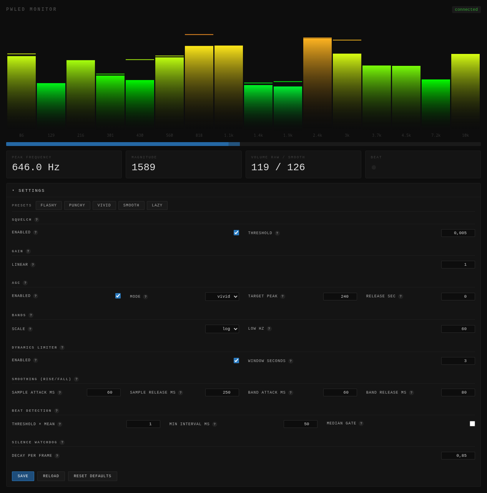

# pwled

A Linux/PipeWire audio-reactive sender for [WLED](https://github.com/wled/WLED).
It captures any PipeWire source (your music output, a microphone, a virtual
sink), runs a small DSP pipeline (gain → squelch → FFT → AGC → limiter →
per-band rise/fall smoothing → beat detection), and emits
[WLED Audio Sync v2](docs/audio-sync-protocol.md) UDP packets to one or many
WLED nodes running the AudioReactive usermod in **Receive** mode.

A web UI on `:8080` lets you watch the live spectrum and tweak the DSP knobs
without a restart. Settings persist to `$XDG_CONFIG_HOME/pwled/config.toml`.



## Features

- Captures audio from any PipeWire node (`pw-cat`-based), with port linking
  done automatically.
- Full sender-side DSP: squelch, gain, AGC (three modes), per-band dynamics
  limiter, asymmetric rise/fall smoothing, onset/beat detector, silence
  watchdog.
- Five built-in presets — **Flashy / Punchy / Vivid / Smooth / Lazy** —
  spanning party to ambient. Make and save your own from the web UI.
- **Activity gate**: when audio is quiet for longer than a configurable
  timeout the UDP sender pauses entirely, so another sender on the LAN can
  take over after WLED's ~500 ms receive timeout.
- **Home Assistant** integration via MQTT discovery — exposes the preset list
  as a `select` and the activity gate as a `binary_sensor`.

## WLED setup

On the WLED node:

1. Flash a build with the **Audio Reactive** usermod (e.g. AC-WLED / WLED-MM
   or any audioreactive-enabled bin).
2. **Settings → Usermods → Audio Reactive → Sync mode**: set to **Receive**.
3. **Settings → Sync Interfaces**: leave the receive port at the default
   `11988`. pwled broadcasts on `255.255.255.255:11988` by default.
4. Pick an audioreactive effect (e.g. "2D GEQ", "Freqmap", "Waterfall").
   See [docs/audio-effects.md](docs/audio-effects.md) for what each effect
   does with the wire data and which pwled preset suits which look.

## Install

### Build from source

```sh
make            # builds bin/pwled for your host
make build-arm64   # cross-compiles for Pi 4/5 (64-bit)
make build-armhf   # cross-compiles for Pi 2/3 (armv7)
```

Requires Go 1.22+ and `pw-cat` / `pw-link` from PipeWire on the host you run it
on.

### Run

```sh
pwled --list                       # list PipeWire nodes
pwled -t alsa_output.X.analog-stereo.monitor   # capture a sink monitor
```

Common flags:

| Flag                       | Default            | Notes                                                |
| -------------------------- | ------------------ | ---------------------------------------------------- |
| `-t, --target`             | (PipeWire default) | PipeWire node name or numeric ID.                    |
| `-d, --dest`               | `255.255.255.255`  | UDP destination (broadcast / unicast / multicast).   |
| `-p, --port`               | `11988`            | UDP destination port.                                |
| `-r, --rate`               | `44100`            | Sample rate.                                         |
| `-H, --http`               | `:8080`            | HTTP monitor address; empty to disable.              |
| `--config`                 | XDG path           | Path to TOML config; auto-created on first run.      |
| `--mqtt-broker`            | (disabled)         | e.g. `tcp://192.168.1.10:1883`.                      |
| `--mqtt-user/--mqtt-pass`  | —                  | MQTT credentials (optional).                         |
| `--mqtt-node-id`           | `pwled`            | Identifier used in MQTT topics + HA unique_id.       |
| `--mqtt-discovery-prefix`  | `homeassistant`    | HA discovery topic prefix.                           |

### Home Assistant

When `--mqtt-broker` is set, pwled publishes:

- `select.pwled_<node_id>_preset` — applies the named preset on change.
- `binary_sensor.pwled_<node_id>_activity` — `active` while audio is above
  the activity threshold, `idle` otherwise.

Both entities go offline (LWT) if pwled crashes or the network drops.

### systemd (user)

A user-unit template is in [`contrib/systemd/pwled.service`](contrib/systemd/pwled.service)
and expects the binary at `~/.local/bin/pwled`:

```sh
install -Dm755 bin/pwled ~/.local/bin/pwled
install -Dm644 contrib/systemd/pwled.service ~/.config/systemd/user/pwled.service
systemctl --user daemon-reload
systemctl --user enable --now pwled
```

## Documentation

- [docs/audio-sync-protocol.md](docs/audio-sync-protocol.md) — the v2 wire
  format and what each field means, with cross-references to pwled's
  implementation.
- [docs/audio-effects.md](docs/audio-effects.md) — per-effect breakdown of
  what WLED's audio effects do with the packet, plus guidance for picking
  presets and palettes.

## Credits

- **[SR-WLED-audio-server-win](https://github.com/MoonModules/SR-WLED-audio-server-win)**
  — the Windows sender that inspired this project; its source was the
  reference for the wire format and the DSP defaults.
- **[WLED](https://github.com/wled/WLED)** — for the firmware that made any
  of this possible. Thank you.

## License

MIT — see [LICENSE](LICENSE).
